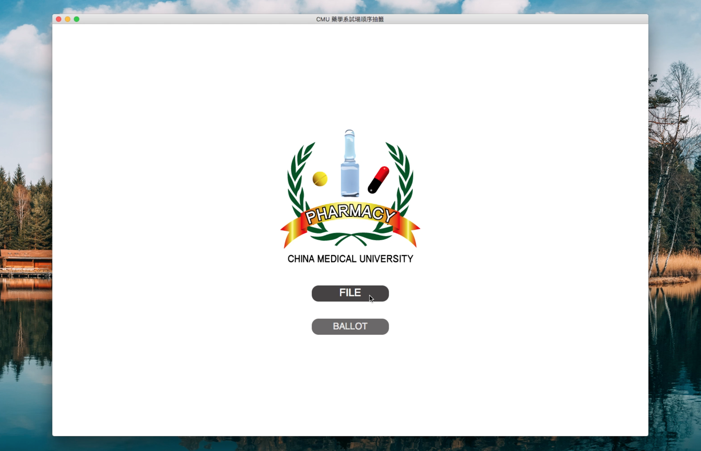

# ballot_CMU

It has user interface, choose file from the computer at first, then click BALLOT Btn!
\# PyQt \#xlrd \#xlwt
> 1. Choose Excel file.
> 2. Click BALLOT, adjust number of person in each class.
> 3. Click START!

